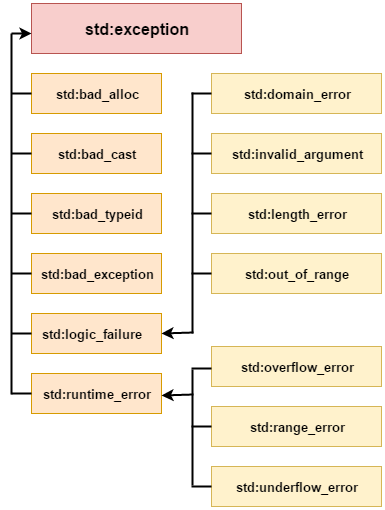

# **Exception in c++**
> ## 
Definition

- *Exception Handling* in C++ is a process to handle runtime errors. We perform exception handling so the normal flow of the application can be maintained even after runtime errors.

----

> ## 
Advantage

- It maintains the normal flow of the application. In such case, rest of the code is executed even after exception.

> ## 
Classes

> ## 
Examples

| Exception | Description |
| --------- | ----------- |
| std::exception | It is an exception and parent class of all standard C++ exceptions. |
| std::logic_failure | It is an exception that can be detected by reading a code. |
| std::runtime_error | It is an exception that cannot be detected by reading a code. |
| std::bad_exception | It is used to handle the unexpected exceptions in a c++ program. |
| std::bad_cast | This exception is generally be thrown by dynamic_cast. |
| std::bad_typeid |	This exception is generally be thrown by typeid. |
| std::bad_alloc | This exception is generally be thrown by new. |

> ## 
Keywords

- try
- catch
- throw